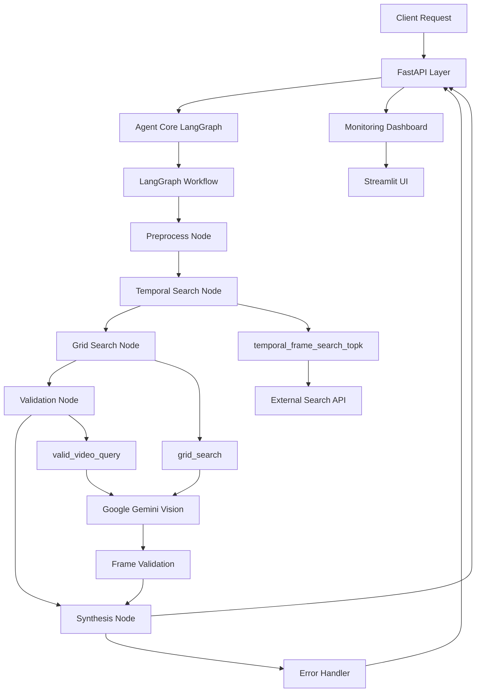
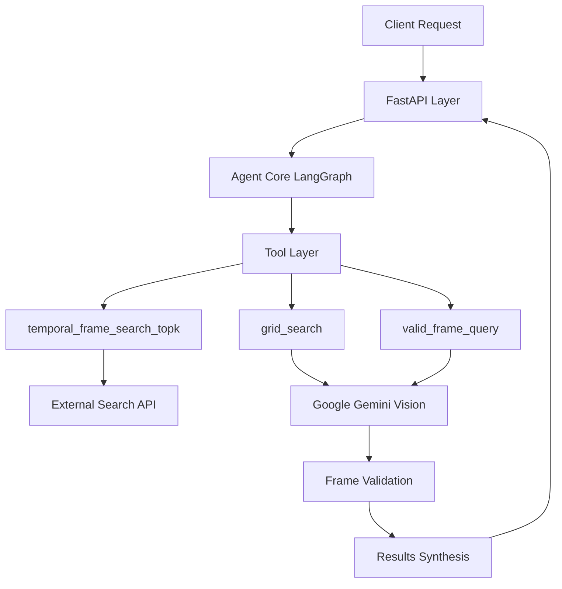

# Agentic RAG: Intelligent Video Frame Retrieval System

[🇻🇳 Tiếng Việt](#tiếng-việt) | [🇺🇸 English](#english)

---

# English

An intelligent agent system using Google Gemini and **LangGraph** to automate video frame retrieval and validation based on natural language descriptions.

## 🎯 Overview

This project implements an agentic RAG (Retrieval-Augmented Generation) system that enables intelligent video frame search and analysis using natural language queries. The system leverages Google Gemini's vision capabilities, **LangGraph's workflow framework**, and advanced search strategies to find and validate video frames that match user descriptions.

### Key Features

- **🤖 Intelligent Agent**: Structured LangGraph workflow with state management
- **🔍 Advanced Search**: Temporal frame search with OCR and text recognition
- **🎯 Accurate Validation**: Grid-based batch processing and frame-by-frame validation
- **📊 Real-time Monitoring**: Streamlit dashboard for tracking agent reasoning
- **🌐 RESTful API**: FastAPI-based web service with comprehensive documentation
- **🐳 Docker Ready**: Containerized deployment with docker-compose support
- **⚡ Improved Reliability**: Better error handling and workflow control with LangGraph

## 🏗️ Architecture



### Core Components

- **Agent Core**: LangGraph-powered workflow engine with structured state management
- **Tools Layer**: Specialized tools for frame search, validation, and analysis
- **Monitoring System**: Real-time tracking of agent decisions and performance
- **API Layer**: RESTful endpoints for integration and testing

## 🚀 Quick Start

### Prerequisites

- Python 3.8+
- Docker & Docker Compose
- Google API Key with Gemini access

### Installation

1. **Clone and Setup**
   ```bash
   cd agentic_rag
   pip install -r requirements.txt
   ```

2. **Environment Configuration**
   ```bash
   # Create .env file
   echo "GOOGLE_API_KEY=your_api_key" > .env
   echo "TEMPORAL_SEARCH_API_URL=your_search_api" >> .env
   ```

3. **Start Services**
   ```bash
   # Docker deployment
   docker-compose up -d
   
   # Or development mode
   python -m app.main
   ```

### API Usage

```python
import requests

# Search for video frames
response = requests.post("http://localhost:8000/find-video", json={
    "query": "Show me frames with a person holding a red apple"
})

result = response.json()
print(f"Found video: {result['video_id']}")
print(f"Relevant frames: {result['frame_numbers']}")
```

## 📊 LangGraph Workflow

The system uses LangGraph to implement a structured, stateful workflow for video frame retrieval:

### Workflow States

- **Preprocessing**: Query analysis and planning
- **Temporal Search**: Time-based frame retrieval
- **Grid Search**: Batch visual analysis
- **Validation**: Frame-by-frame accuracy checking
- **Synthesis**: Result compilation and ranking
- **Error Handling**: Fallback mechanisms and error recovery

### Key Improvements with LangGraph

- **Better State Management**: Structured state tracking across workflow steps
- **Conditional Routing**: Dynamic path selection based on intermediate results
- **Error Recovery**: Built-in fallback mechanisms and error handling
- **Debugging**: Enhanced observability and workflow monitoring
- **Scalability**: More maintainable and extensible architecture

## 🔧 Configuration

### Core Settings (`app/config.py`)

```python
# LangGraph Configuration
WORKFLOW_TIMEOUT = 300  # seconds
MAX_RETRIES = 3
ENABLE_DEBUGGING = True

# Search Configuration
MAX_FRAMES_PER_SEARCH = 50
GRID_SEARCH_BATCH_SIZE = 9
TEMPORAL_SEARCH_THRESHOLD = 0.8
```

### Environment Variables

```bash
# Required
GOOGLE_API_KEY=your_gemini_api_key
TEMPORAL_SEARCH_API_URL=http://your-search-api

# Optional
WORKFLOW_DEBUG=true
MAX_CONCURRENT_REQUESTS=10
CACHE_TTL=3600
```### Additional Endpoints

- `GET /` - API information and status
- `GET /health` - Health check endpoint
- `GET /docs` - Interactive API documentation
- `GET /redoc` - Alternative API documentation

## 🧪 Testing

Run the test suite:

```bash
# Run all tests
pytest tests/ -v

# Run with coverage
pytest tests/ --cov=app --cov-report=html

# Run specific test files
pytest tests/test_agent.py
pytest tests/test_tools.py
pytest tests/test_api.py
```

## 📁 Project Structure

```
agentic_rag/
├── app/
│   ├── __init__.py
│   ├── main.py                 # FastAPI application
│   ├── agent_core.py           # LangGraph agent interface
│   ├── langgraph_agent.py      # LangGraph workflow implementation
│   ├── tools.py                # Search and validation tools
│   ├── config.py               # Configuration management
│   ├── schemas.py              # Pydantic models
│   ├── utils.py                # Utility functions
│   ├── callbacks.py            # LangGraph callbacks
│   └── monitoring.py           # Agent monitoring
├── docs/
│   ├── LANGGRAPH_IMPLEMENTATION.md  # LangGraph migration guide
│   ├── LANGGRAPH_REFACTORING.md     # Complete refactoring documentation
│   └── MONITORING.md                # Monitoring setup
├── requirements.txt            # Python dependencies
├── docker-compose.yml          # Docker services
├── Dockerfile                  # Container definition
└── README.md                   # This file
```

## 🛠️ Development

### LangGraph Workflow Development

The core agent logic is implemented using LangGraph's StateGraph pattern:

```python
from langgraph.graph import StateGraph
from app.schemas import VideoRetrievalState

# Create workflow
workflow = StateGraph(VideoRetrievalState)

# Add nodes
workflow.add_node("preprocess", preprocess_query_node)
workflow.add_node("temporal_search", temporal_search_node)
workflow.add_node("grid_search", grid_search_node)
workflow.add_node("validation", validation_node)
workflow.add_node("synthesis", response_synthesis_node)

# Add conditional routing
workflow.add_conditional_edges(
    "temporal_search",
    should_continue_to_grid_search,
    {
        "continue": "grid_search",
        "retry": "temporal_search",
        "end": "synthesis"
    }
)
```

### Running Tests

```bash
# Structure validation
python -c "
from app.agent_core import VideoRetrievalAgent
from app.langgraph_agent import LangGraphVideoAgent
print('✓ All imports successful')
"

# Integration tests
python -m pytest tests/ -v

# Workflow debugging
python -c "
from app.langgraph_agent import LangGraphVideoAgent
agent = LangGraphVideoAgent()
print('✓ LangGraph workflow compiled successfully')
"
```

### Monitoring

Start the monitoring dashboard:

```bash
streamlit run streamlit_monitoring.py
```

Access at: http://localhost:8501

## 📊 Performance & Monitoring

### Key Metrics

- **Search Accuracy**: Frame relevance scoring
- **Response Time**: End-to-end query processing
- **Workflow Efficiency**: Node execution times
- **Error Rates**: Failure and retry statistics

### LangGraph Benefits

- **Structured State**: Type-safe state management
- **Better Debugging**: Visual workflow inspection
- **Error Recovery**: Automatic retry and fallback mechanisms
- **Scalable Architecture**: Easy to extend with new nodes

## 🐛 Troubleshooting

### Common Issues

1. **Import Errors**
   ```bash
   # Ensure all dependencies installed
   pip install -r requirements.txt
   ```

2. **Google API Issues**
   ```bash
   # Verify API key
   export GOOGLE_API_KEY=your_key
   python -c "import google.generativeai as genai; genai.configure(api_key='$GOOGLE_API_KEY')"
   ```

3. **Workflow Failures**
   ```bash
   # Enable debug mode
   export WORKFLOW_DEBUG=true
   python -m app.main
   ```

### Debug Mode

Enable comprehensive logging:

```python
import logging
logging.basicConfig(level=logging.DEBUG)

from app.langgraph_agent import LangGraphVideoAgent
agent = LangGraphVideoAgent(debug=True)
```

---

# Tiếng Việt

Hệ thống agent thông minh sử dụng Google Gemini và **LangGraph** để tự động tìm kiếm và xác thực khung hình video dựa trên mô tả ngôn ngữ tự nhiên.

## 🎯 Tổng quan

Dự án này triển khai một hệ thống agentic RAG (Retrieval-Augmented Generation) cho phép tìm kiếm và phân tích khung hình video thông minh bằng truy vấn ngôn ngữ tự nhiên. Hệ thống tận dụng khả năng thị giác của Google Gemini, **framework workflow LangGraph**, và các chiến lược tìm kiếm tiên tiến để tìm và xác thực các khung hình video phù hợp với mô tả của người dùng.

### Tính năng chính

- **🤖 Agent Thông minh**: Workflow LangGraph có cấu trúc với quản lý trạng thái
- **� Tìm kiếm Tiên tiến**: Tìm kiếm khung hình theo thời gian với OCR và nhận dạng văn bản
- **🎯 Xác thực Chính xác**: Xử lý batch dựa trên lưới và xác thực từng khung hình
- **📊 Giám sát Thời gian thực**: Dashboard Streamlit để theo dõi suy luận của agent
- **🌐 API RESTful**: Dịch vụ web FastAPI với tài liệu toàn diện
- **🐳 Sẵn sàng Docker**: Triển khai containerized với hỗ trợ docker-compose
- **⚡ Độ tin cậy Cải thiện**: Xử lý lỗi tốt hơn và kiểm soát workflow với LangGraph

## 🏗️ Kiến trúc

Hệ thống sử dụng LangGraph để triển khai workflow có cấu trúc, có trạng thái cho việc truy xuất khung hình video với các node chuyên biệt và routing có điều kiện.

### Các thành phần chính

- **Agent Core**: Engine workflow LangGraph với quản lý trạng thái có cấu trúc
- **Tool Layer**: Bộ công cụ tìm kiếm và xác thực
- **API Layer**: Endpoints FastAPI với documentation OpenAPI
- **Monitoring**: Dashboard Streamlit cho theo dõi và debug

## 🚀 Bắt đầu nhanh

### Yêu cầu hệ thống

- Python 3.8+
- Docker & Docker Compose
- Google API Key với quyền truy cập Gemini

### Cài đặt

1. **Clone và Setup**
   ```bash
   cd agentic_rag
   pip install -r requirements.txt
   ```

2. **Cấu hình môi trường**
   ```bash
   # Tạo file .env
   echo "GOOGLE_API_KEY=your_api_key" > .env
   echo "TEMPORAL_SEARCH_API_URL=your_search_api" >> .env
   ```

3. **Khởi động dịch vụ**
   ```bash
   # Triển khai Docker
   docker-compose up -d
   
   # Hoặc chế độ development
   python -m app.main
   ```

## 📊 LangGraph Workflow

Hệ thống sử dụng LangGraph để triển khai workflow có cấu trúc, có trạng thái:

### Các trạng thái Workflow

- **Preprocessing**: Phân tích truy vấn và lập kế hoạch
- **Temporal Search**: Truy xuất khung hình dựa trên thời gian
- **Grid Search**: Phân tích thị giác batch
- **Validation**: Kiểm tra độ chính xác từng khung hình
- **Synthesis**: Biên dịch và xếp hạng kết quả
- **Error Handling**: Cơ chế fallback và phục hồi lỗi

### Cải tiến chính với LangGraph

- **Quản lý Trạng thái Tốt hơn**: Theo dõi trạng thái có cấu trúc qua các bước workflow
- **Routing Có điều kiện**: Lựa chọn đường dẫn động dựa trên kết quả trung gian
- **Phục hồi Lỗi**: Cơ chế fallback tích hợp và xử lý lỗi
- **Debugging**: Tăng cường khả năng quan sát và giám sát workflow
- **Khả năng mở rộng**: Kiến trúc dễ bảo trì và mở rộng hơn

## 🔧 Cấu hình

### Cài đặt cốt lõi (`app/config.py`)

```python
# Cấu hình LangGraph
WORKFLOW_TIMEOUT = 300  # giây
MAX_RETRIES = 3
ENABLE_DEBUGGING = True

# Cấu hình tìm kiếm
MAX_FRAMES_PER_SEARCH = 50
GRID_SEARCH_BATCH_SIZE = 9
TEMPORAL_SEARCH_THRESHOLD = 0.8
```

## 🛠️ Phát triển

### Phát triển LangGraph Workflow

Logic agent cốt lõi được triển khai bằng pattern StateGraph của LangGraph:

```python
from langgraph.graph import StateGraph
from app.schemas import VideoRetrievalState

# Tạo workflow
workflow = StateGraph(VideoRetrievalState)

# Thêm nodes
workflow.add_node("preprocess", preprocess_query_node)
workflow.add_node("temporal_search", temporal_search_node)
workflow.add_node("grid_search", grid_search_node)
workflow.add_node("validation", validation_node)
workflow.add_node("synthesis", response_synthesis_node)

# Thêm routing có điều kiện
workflow.add_conditional_edges(
    "temporal_search",
    should_continue_to_grid_search,
    {
        "continue": "grid_search",
        "retry": "temporal_search",
        "end": "synthesis"
    }
)
```

### Chạy kiểm thử

```bash
# Xác thực cấu trúc
python -c "
from app.agent_core import VideoRetrievalAgent
from app.langgraph_agent import LangGraphVideoAgent
print('✓ Tất cả imports thành công')
"

# Kiểm thử tích hợp
python -m pytest tests/ -v

# Debug workflow
python -c "
from app.langgraph_agent import LangGraphVideoAgent
agent = LangGraphVideoAgent()
print('✓ LangGraph workflow compiled thành công')
"
```

## 📊 Hiệu suất & Giám sát

### Chỉ số chính

- **Độ chính xác Tìm kiếm**: Điểm số liên quan của khung hình
- **Thời gian Phản hồi**: Xử lý truy vấn end-to-end
- **Hiệu quả Workflow**: Thời gian thực thi node
- **Tỷ lệ Lỗi**: Thống kê thất bại và retry

### Lợi ích của LangGraph

- **Trạng thái Có cấu trúc**: Quản lý trạng thái type-safe
- **Debug Tốt hơn**: Kiểm tra workflow trực quan
- **Phục hồi Lỗi**: Cơ chế retry và fallback tự động
- **Kiến trúc Mở rộng**: Dễ dàng mở rộng với các node mới

## 🐛 Khắc phục sự cố

### Vấn đề thường gặp

1. **Lỗi Import**
   ```bash
   # Đảm bảo tất cả dependencies đã cài đặt
   pip install -r requirements.txt
   ```

2. **Vấn đề Google API**
   ```bash
   # Xác minh API key
   export GOOGLE_API_KEY=your_key
   python -c "import google.generativeai as genai; genai.configure(api_key='$GOOGLE_API_KEY')"
   ```

3. **Lỗi Workflow**
   ```bash
   # Bật chế độ debug
   export WORKFLOW_DEBUG=true
   python -m app.main
   ```

## 📚 Tài liệu

- [LANGGRAPH_IMPLEMENTATION.md](docs/LANGGRAPH_IMPLEMENTATION.md): Hướng dẫn triển khai LangGraph
- [LANGGRAPH_REFACTORING.md](docs/LANGGRAPH_REFACTORING.md): Tài liệu refactoring hoàn chỉnh
- [MONITORING.md](docs/MONITORING.md): Thiết lập giám sát

## 🤝 Đóng góp

1. Fork dự án
2. Tạo feature branch (`git checkout -b feature/AmazingFeature`)
3. Commit thay đổi (`git commit -m 'Add some AmazingFeature'`)
4. Push to branch (`git push origin feature/AmazingFeature`)
5. Mở Pull Request

## 📄 Giấy phép

Dự án này được cấp phép theo MIT License - xem file [LICENSE](LICENSE) để biết chi tiết.

---

## 🔄 Migration Notes

**Đã di chuyển từ LangChain sang LangGraph** ✅

- **Cải tiến**: Workflow có cấu trúc tốt hơn với quản lý trạng thái
- **Backwards Compatible**: API endpoints giữ nguyên interface
- **Better Error Handling**: Cơ chế phục hồi lỗi cải thiện
- **Enhanced Debugging**: Khả năng quan sát workflow tốt hơn

Xem [LANGGRAPH_REFACTORING.md](docs/LANGGRAPH_REFACTORING.md) để biết chi tiết về quá trình migration.

### Phase 0: Query Translation and Preparation
- Translate user queries to English while preserving structure
- Prepare query sequences with text and OCR fields
- Initialize primary search with `temporal_frame_search_topk`

### Phase 1: Primary Search
- Execute temporal frame search with prepared queries
- Handle both sequential events and simple descriptions
- Support for OCR text recognition in frames

### Phase 2: Validation and Fallback
The system implements multiple fallback strategies:

1. **Grid Search Validation**: Batch processing of candidate frames
2. **Broader Query Strategy**: Simplified, more general descriptions
3. **Component-Based Search**: Breaking complex queries into parts
4. **Alternative Descriptions**: Using synonyms and related terms
5. **OCR-Focused Search**: Targeting text content in frames
6. **Partial Match Search**: Finding frames with key elements

### Phase 3: Results Validation
- Grid-based batch validation for efficiency
- Frame-by-frame detailed validation when needed
- Confidence scoring and reasoning generation

## 🔧 Advanced Configuration

### Google Gemini Settings
```python
GEMINI_MODEL = "gemini-pro-vision"
GEMINI_TEMPERATURE = 0.1  # Lower for more consistent results
GEMINI_MAX_TOKENS = 2048
```

### Agent Configuration
```python
# Agent behavior settings
MAX_ITERATIONS = 60
MAX_EXECUTION_TIME = 600  # seconds
HANDLE_PARSING_ERRORS = True
```

### Search Parameters
```python
# Search configuration
DEFAULT_K = 10  # Number of top results
GRID_DIMENSIONS = (3, 4)  # For 12-frame grids
API_REQUEST_TIMEOUT = 30  # seconds
```

## 📊 Monitoring and Analytics

The system includes comprehensive monitoring capabilities:

### Real-time Dashboard Features
- Agent reasoning step visualization
- Search strategy tracking
- Performance metrics
- Frame analysis results
- API usage statistics

### Accessing the Dashboard
```bash
streamlit run streamlit_monitoring.py --server.port 8501
```

### Monitoring API
- Session tracking
- Step-by-step reasoning logs
- Performance analytics
- Error tracking and debugging

## 🚀 Deployment

### Docker Deployment
```bash
# Build and run with docker-compose
docker-compose up -d

# Scale the service
docker-compose up -d --scale agentic-rag=3
```

### Cloud Deployment Options

#### Google Cloud Run
```bash
gcloud run deploy agentic-rag \
  --source . \
  --platform managed \
  --region us-central1 \
  --allow-unauthenticated
```

#### AWS ECS/Fargate
```bash
# Build and push to ECR
aws ecr get-login-password --region us-east-1 | docker login --username AWS --password-stdin 123456789012.dkr.ecr.us-east-1.amazonaws.com
docker build -t agentic-rag .
docker tag agentic-rag:latest 123456789012.dkr.ecr.us-east-1.amazonaws.com/agentic-rag:latest
docker push 123456789012.dkr.ecr.us-east-1.amazonaws.com/agentic-rag:latest
```

### Environment Variables for Production
```env
# Production settings
DEBUG=false
LOG_LEVEL=INFO
WORKERS=4
MAX_CONNECTIONS=1000

# Security
CORS_ORIGINS=["https://yourdomain.com"]
API_KEY_REQUIRED=true

# Performance
REDIS_URL=redis://redis:6379/0
DATABASE_URL=postgresql://user:pass@db:5432/agentic_rag
```

## 🐛 Troubleshooting

### Common Issues

#### 1. Google API Key Issues
```bash
# Verify API key access
curl -H "Authorization: Bearer $(gcloud auth print-access-token)" \
     https://generativelanguage.googleapis.com/v1beta/models
```

#### 2. Memory Issues
```bash
# Monitor memory usage
docker stats agentic-rag

# Adjust worker processes
export WORKERS=2
```

#### 3. Import Errors
```bash
# Reinstall dependencies
pip install --upgrade -r requirements.txt

# Check Python version
python --version  # Should be 3.11+
```

#### 4. External API Timeouts
```env
# Increase timeout settings
API_REQUEST_TIMEOUT=60
HTTPX_TIMEOUT=30
```

### Debug Mode
Enable debug logging:
```env
DEBUG=true
LOG_LEVEL=DEBUG
```

### Health Checks
Monitor application health:
```bash
# API health
curl http://localhost:8000/health

# Agent status
curl http://localhost:8000/agent/status
```

## 📈 Performance Optimization

### Caching Strategies
- Frame caching for repeated queries
- API response caching
- Gemini result memoization

### Scaling Considerations
- Horizontal scaling with multiple workers
- Load balancing for high traffic
- Database optimization for monitoring data

### Resource Management
- Memory usage optimization
- API rate limiting
- Background task processing

## 🤝 Contributing

We welcome contributions! Please follow these guidelines:

### Development Setup
```bash
# Install development dependencies
pip install -r requirements-dev.txt

# Install pre-commit hooks
pre-commit install

# Run tests before committing
pytest tests/ --cov=app
```

### Contribution Process
1. Fork the repository
2. Create a feature branch: `git checkout -b feature/amazing-feature`
3. Make your changes and add tests
4. Ensure all tests pass: `pytest tests/`
5. Commit with conventional commits: `git commit -m "feat: add amazing feature"`
6. Push to your fork: `git push origin feature/amazing-feature`
7. Create a Pull Request

### Code Standards
- Follow PEP 8 style guidelines
- Add type hints for all functions
- Write comprehensive docstrings
- Maintain test coverage above 80%

## 📄 License

This project is licensed under the MIT License - see the [LICENSE](LICENSE) file for details.

## 📞 Support

- **Documentation**: [Full API Documentation](http://localhost:8000/docs)
- **Issues**: [GitHub Issues](https://github.com/your-repo/agentic_rag/issues)
- **Discussions**: [GitHub Discussions](https://github.com/your-repo/agentic_rag/discussions)

---

**Version**: 2.0.0  
**Last Updated**: January 2025  
**Status**: Production Ready

---

# Tiếng Việt

Một hệ thống agent thông minh sử dụng Google Gemini để tự động hóa quy trình truy xuất video dựa trên mô tả bằng ngôn ngữ tự nhiên.

## 📋 Mục tiêu

- **Tự động hóa**: Giảm thiểu tối đa sự can thiệp của con người trong việc tìm kiếm và sàng lọc nội dung media
- **Tăng độ chính xác**: Tận dụng khả năng hiểu ngữ cảnh sâu sắc của Gemini để trả về kết quả phù hợp hơn
- **Nâng cao trải nghiệm người dùng**: Cho phép tìm kiếm media bằng ngôn ngữ tự nhiên, linh hoạt và trực quan

## 🏗️ Kiến trúc

Hệ thống sử dụng kiến trúc Agent-Tool được điều phối bởi LangGraph:



### Các thành phần chính

- **Agent Core**: Bộ não suy luận được hỗ trợ bởi LangGraph với chiến lược tìm kiếm đa tầng
- **Tool Layer**: Các công cụ chuyên biệt cho tìm kiếm, xác thực và phân tích frame
- **Monitoring System**: Theo dõi thời gian thực các quyết định và hiệu suất của agent
- **API Layer**: Các endpoint RESTful để tích hợp và kiểm thử

## 🛠️ Cài đặt và Triển khai

### Yêu cầu hệ thống

- Python 3.11+
- Google API Key với quyền truy cập Gemini
- Docker & Docker Compose (tùy chọn)

### 1. Clone dự án và tạo môi trường ảo

```bash
git clone <https://github.com/voicon324/agentic_rag.git>
cd agentic_rag
python -m venv venv
source venv/bin/activate  # Linux/Mac
# hoặc
venv\Scripts\activate     # Windows
```

### 2. Cài đặt dependencies

```bash
pip install -r requirements.txt
```

### 3. Cấu hình môi trường

Sao chép file template và điền thông tin:

```bash
cp .env.template .env
# Chỉnh sửa file .env với cấu hình của bạn
```

Cấu hình file `.env`:

```env
# Google API Configuration
GOOGLE_API_KEY=your_google_api_key_here

# External API URLs
SEARCH_API_URL=https://your-search-api.com/search
MEDIA_API_URL=https://your-media-api.com/media

# Gemini Configuration
GEMINI_MODEL=gemini-pro-vision
GEMINI_TEMPERATURE=0.1
GEMINI_MAX_TOKENS=2048

# Application Settings
DEBUG=false
APP_NAME=Agentic RAG Video Retrieval
APP_VERSION=2.0.0
```

### 4. Chạy ứng dụng

#### Development mode:
```bash
uvicorn app.main:app --reload --host 0.0.0.0 --port 8000
```

#### Production mode:
```bash
uvicorn app.main:app --host 0.0.0.0 --port 8000 --workers 4
```

#### Với Docker:
```bash
docker-compose up -d
```

#### Dashboard giám sát:
```bash
streamlit run streamlit_monitoring.py --server.port 8501
```

### 5. Truy cập ứng dụng

- **API Documentation**: http://localhost:8000/docs
- **ReDoc**: http://localhost:8000/redoc
- **Health Check**: http://localhost:8000/health
- **Monitoring Dashboard**: http://localhost:8501

## 🔧 Sử dụng API

### Endpoint chính: POST /find-video

Tìm kiếm video dựa trên mô tả ngôn ngữ tự nhiên.

**Request:**
```json
{
  "description": "Một người đang dắt chó đi dạo trong công viên vào ngày nắng"
}
```

**Response (Thành công):**
```json
{
  "success": true,
  "frames": [
    "L05_V027/23198.jpg",
    "L05_V027/23199.jpg",
    "L05_V027/23200.jpg"
  ],
  "confidence_score": 0.95,
  "reasoning": "Tìm thấy các frame cho thấy một người đang dắt chó trong môi trường công viên với ánh sáng tự nhiên tươi sáng cho thấy thời tiết nắng đẹp."
}
```

**Response (Không tìm thấy):**
```json
{
  "success": false,
  "error_type": "no_match",
  "error_message": "Không tìm thấy frame phù hợp với mô tả"
}
```

### Ví dụ sử dụng API

#### Python
```python
import requests

response = requests.post(
    "http://localhost:8000/find-video",
    json={"description": "Một chiếc xe hơi rẽ phải tại ngã tư"}
)
result = response.json()
print(result)
```

#### cURL
```bash
curl -X POST "http://localhost:8000/find-video" \
     -H "Content-Type: application/json" \
     -d '{"description": "Một con mèo đang ngủ trên ghế sofa"}'
```

## 🧪 Chạy Tests

```bash
# Chạy tất cả tests
pytest tests/ -v

# Chạy với coverage
pytest tests/ --cov=app --cov-report=html

# Chạy tests cụ thể
pytest tests/test_agent.py
pytest tests/test_tools.py
pytest tests/test_api.py
```

## 📁 Cấu trúc Dự án

```
agentic_rag/
├── app/                          # Package ứng dụng chính
│   ├── __init__.py              # Khởi tạo package
│   ├── main.py              # Ứng dụng FastAPI
│   ├── agent_core.py        # Triển khai LangGraph agent
│   ├── tools.py             # Công cụ agent (tìm kiếm, xác thực)
│   ├── schemas.py           # Mô hình và schema Pydantic
│   ├── config.py            # Quản lý cấu hình
│   ├── monitoring.py        # Hệ thống giám sát agent
│   ├── frame_viewer.py      # Tiện ích hiển thị frame
│   └── utils.py             # Các tiện ích hỗ trợ
├── tests/                       # Bộ test
│   ├── test_agent.py           # Tests cho agent core
│   ├── test_tools.py           # Tests cho tools
│   └── test_api.py             # Tests tích hợp API
├── docs/                        # Tài liệu
│   ├── MONITORING.md           # Hướng dẫn giám sát
│   ├── FRAME_LOADING_FIX.md    # Sửa lỗi kỹ thuật
│   └── JSON_PARSING_FIX.md     # Sửa lỗi parsing
├── streamlit_monitoring.py      # Dashboard giám sát
├── demo_monitoring.py          # Script demo giám sát
├── docker-compose.yml          # Cấu hình Docker compose
├── Dockerfile                  # Cấu hình container Docker
├── requirements.txt            # Dependencies Python
├── .env.template              # Template môi trường
├── .gitignore                 # Patterns Git ignore
└── README.md                  # File này
```

## 🔄 Luồng hoạt động Agent

Hệ thống sử dụng phương pháp tìm kiếm đa chiến lược tinh vi:

### Giai đoạn 0: Dịch và Chuẩn bị Query
- Dịch truy vấn người dùng sang tiếng Anh giữ nguyên cấu trúc
- Chuẩn bị chuỗi truy vấn với trường text và OCR
- Khởi tạo tìm kiếm chính với `temporal_frame_search_topk`

### Giai đoạn 1: Tìm kiếm Chính
- Thực hiện tìm kiếm temporal frame với các truy vấn đã chuẩn bị
- Xử lý cả sự kiện tuần tự và mô tả đơn giản
- Hỗ trợ nhận dạng text OCR trong frames

### Giai đoạn 2: Xác thực và Fallback
Hệ thống triển khai nhiều chiến lược fallback:

1. **Grid Search Validation**: Xử lý batch các frame ứng viên
2. **Broader Query Strategy**: Mô tả đơn giản hóa, tổng quát hơn
3. **Component-Based Search**: Chia nhỏ truy vấn phức tạp thành các phần
4. **Alternative Descriptions**: Sử dụng từ đồng nghĩa và thuật ngữ liên quan
5. **OCR-Focused Search**: Nhắm mục tiêu nội dung text trong frames
6. **Partial Match Search**: Tìm frames với các yếu tố chính

### Giai đoạn 3: Xác thực Kết quả
- Xác thực batch dựa trên grid để tăng hiệu quả
- Xác thực chi tiết từng frame khi cần thiết
- Tính điểm tin cậy và tạo lý do

## � Cấu hình Nâng cao

### Cài đặt Google Gemini
```python
GEMINI_MODEL = "gemini-pro-vision"
GEMINI_TEMPERATURE = 0.1  # Thấp hơn để có kết quả nhất quán hơn
GEMINI_MAX_TOKENS = 2048
```

### Cấu hình Agent
```python
# Cài đặt hành vi agent
MAX_ITERATIONS = 60
MAX_EXECUTION_TIME = 600  # giây
HANDLE_PARSING_ERRORS = True
```

## 📊 Giám sát và Phân tích

Hệ thống bao gồm khả năng giám sát toàn diện:

### Tính năng Dashboard Thời gian thực
- Hiển thị các bước suy luận của agent
- Theo dõi chiến lược tìm kiếm
- Số liệu hiệu suất
- Kết quả phân tích frame
- Thống kê sử dụng API

### Truy cập Dashboard
```bash
streamlit run streamlit_monitoring.py --server.port 8501
```

## 🚀 Triển khai

### Triển khai Docker
```bash
# Build và chạy với docker-compose
docker-compose up -d

# Scale service
docker-compose up -d --scale agentic-rag=3
```

### Các tùy chọn Triển khai Cloud

#### Google Cloud Run
```bash
gcloud run deploy agentic-rag \
  --source . \
  --platform managed \
  --region us-central1 \
  --allow-unauthenticated
```

## 🐛 Xử lý sự cố

### Các vấn đề thường gặp

#### 1. Vấn đề Google API Key
```bash
# Xác minh quyền truy cập API key
curl -H "Authorization: Bearer $(gcloud auth print-access-token)" \
     https://generativelanguage.googleapis.com/v1beta/models
```

#### 2. Vấn đề Import
```bash
# Cài đặt lại dependencies
pip install --upgrade -r requirements.txt

# Kiểm tra phiên bản Python
python --version  # Nên là 3.11+
```

### Chế độ Debug
Bật debug logging:
```env
DEBUG=true
LOG_LEVEL=DEBUG
```

## 🤝 Đóng góp

Chúng tôi hoan nghênh mọi đóng góp! Vui lòng làm theo các hướng dẫn sau:

### Thiết lập Development
```bash
# Cài đặt dependencies development
pip install -r requirements-dev.txt

# Cài đặt pre-commit hooks
pre-commit install

# Chạy tests trước khi commit
pytest tests/ --cov=app
```

### Quy trình Đóng góp
1. Fork repository
2. Tạo feature branch: `git checkout -b feature/amazing-feature`
3. Thực hiện thay đổi và thêm tests
4. Đảm bảo tất cả tests pass: `pytest tests/`
5. Commit với conventional commits: `git commit -m "feat: add amazing feature"`
6. Push to fork: `git push origin feature/amazing-feature`
7. Tạo Pull Request

## 📄 License

Dự án này được cấp phép theo MIT License - xem file [LICENSE](LICENSE) để biết chi tiết.

---

**Phiên bản**: 2.0.0  
**Ngày cập nhật**: Tháng 1 năm 2025  
**Trạng thái**: Sẵn sàng Production
