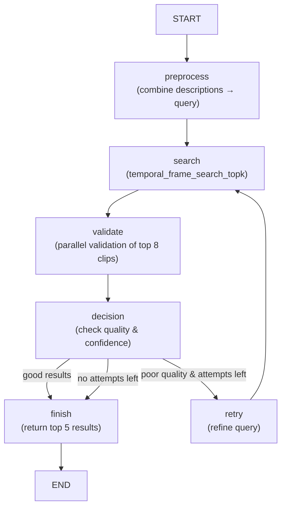

# Simplified Video Retrieval Workflow

## Overview
Đây là workflow đơn giản hóa cho tìm kiếm video với logic retry và user feedback.

## Workflow Flow



## Key Features

### 1. **Search Phase**
- Sử dụng `temporal_frame_search_topk` để tìm 15 candidates
- Convert results thành `ClipHit` objects với metadata

### 2. **Validation Phase**
- Validate song song top 8 clips với ThreadPoolExecutor
- Mỗi clip được kiểm tra bằng `get_video` + `valid_video_query`
- Threshold confidence > 0.4 để pass validation

### 3. **Decision Logic**
- **Good results**: ≥2 clips với confidence > 0.6 → return top 5
- **Poor quality + attempts left**: refine query và retry
- **No attempts left**: return best available (hoặc empty nếu không có)

### 4. **Retry Mechanism**
- Max 3 attempts mặc định
- Refine query based on previous results:
  - Có results nhưng confidence thấp → "Looking for videos that clearly show..."
  - Không có results → "Find any videos related to..." (broader search)

### 5. **User Feedback Support**
- `add_user_feedback()` method để incorporate feedback
- Negative feedback ("not", "wrong") → modify descriptions với "NOT" + add feedback
- Positive feedback → add as additional context

## Usage

```python
from agentic_rag.app.langgraph_search import get_simplified_retrieval

# Initialize
retrieval = get_simplified_retrieval(max_attempts=3)

# Basic search
results = retrieval.search([
    "a person walking in the park",
    "sunny day with trees"
])

# With user feedback
if not results["success"] or user_not_satisfied:
    feedback_results = retrieval.add_user_feedback(
        "The results show indoor scenes, I need outdoor park scenes",
        results
    )
```

## Response Format

```json
{
    "success": true,
    "descriptions": ["original descriptions"],
    "final_results": [
        {
            "video_name": "L01_V001",
            "start_frame": 1234,
            "end_frame": 1264,
            "frames": ["frame1.jpg", "frame2.jpg", ...],
            "confidence_score": 0.85,
            "clip_url": "/media/video_clips/clip.mp4"
        }
    ],
    "search_metadata": {
        "total_attempts": 2,
        "final_success": true,
        "results_count": 3
    },
    "user_feedback": null,
    "error_message": null
}
```

## Fallback Mode
Nếu LangGraph không available, system sẽ tự động chuyển sang sequential execution mode với logic tương tự.

## Configuration
- `max_attempts`: Số lần retry tối đa (default: 3)
- Validation threshold: 0.4 confidence minimum
- Quality threshold: 0.6 confidence cho "good results"
- Top candidates: 8 clips được validate, return top 5
